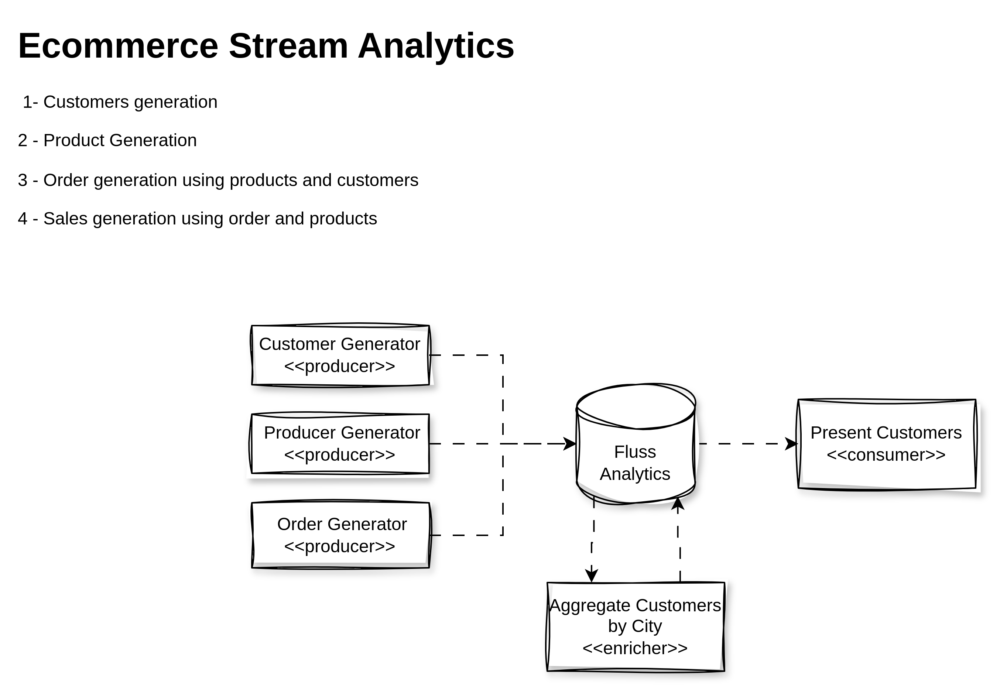

# fluss-examples-data-gen-ecommerce

This example project demonstrates how to generate sample e-commerce data using Fluss. 
It is designed to help new Fluss developers understand data generation, integration, 
and usage within a typical e-commerce scenario using Fluss Javaclient APIs.



## What This Example Does

- Generates synthetic e-commerce data (users, products, orders, etc.).
- Demonstrates data modeling and generation using Fluss.
- Provides sample data for testing, development, or analytics.

## Project Structure

- `src/main/docker`: dockerfile to build image.
- `src/main/java`: Java source code for data generation.
- `pom.xml`: Maven configuration for dependencies and build.

## Prerequisites

- Java 11 or higher
- Maven 3.x

## Setup Steps

1. **Clone the Repository**
   ```bash
   cd fluss-examples/fluss-examples-data-gen-ecommerce
   ```

2. **Build the Project**
   ```bash
   mvn clean package -DskipTests
   
   ```

3. **Run the Data Generator**
   ```bash
   mvn exec:java -Dexec.mainClass="com.example.DataGenEcommerce"
   ```
   Replace `com.example.DataGenEcommerce` with the actual main class if different.

4. **Docker Build (Optional)** go to fluss-examples-data-gen-ecommerce project folder and run the following command to build the Docker image:


```bash
docker build -t  fluss-examples-data-gen-ecommerce:0.8 -f src/main/docker/Dockerfile .
```

